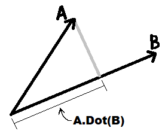
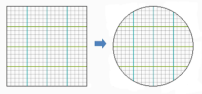
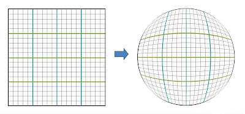
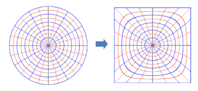

# Vectors

## Vector Length

```csharp
public float Length( Vector2 v ) => Math.Sqrt( v.x*v.x + v.y*v.y );
```

The sqrt operation is a lot to compute, so sometimes a `LengthSquared` is better:

```csharp
public float LengthSquared( Vector2 v ) => v.x*v.x + v.y*v.y;
```


## Vector Dot Product

The dot product is commutative, meaning order does not matter.

The common, simplified explanation of what the dot product does is that it "projects" one vector onto another:



This projection does not have to hit the other vector, it just project onto that vector as an infinite line.

The dot product will return a negative value if projected onto the other side of the origin like so:


#### Dot product function
```csharp
// Vector2D version:
var dotProduct2D = a.x*b.x + a.y*b.y;

// Vector3D version:
var dotProduct3D = a.x*b.x + a.y*b.y + a.z*b.z;
```

## Vector Projecttion

The dot product returns a number (aka a scalar value,) _not_ a vector.
To perform a projection and get back a vector, you can do so _using_ the dot product and the normal of the target vector. This operation is not commutative.

#### Projection function
```csharp
var projected = vecA.Dot( vecB ) * vecB.Normalized();
```


## Circular and Square Domain Mappings

Video game controllers, depending on the engine, will report values back from a circular or square space. The controllers in Godot, for example, give you a value from -1 to 1 for both the x and y, resulting in a square domain.

It's good to be aware of which type of input you are dealing with, especially when using those values to scale movement based on the controller.
Generally speaking, circular-space inputs allow scaling top-down movement without having your character move faster diagonally that up and down. Meanwhile, square-space inputs are better for scaling side-scroller characters, as moving the stick diagonally shouldn't cause the player to slow down horizontally.

The naive approach to moving from square to circular space is to normalize the vector. This, sadly, chops the vector short instead of properly scaling it. Moving the controller diagonally would reach it's max halfway out, then have a large live-zone in the corner. In other words, you get this:



The proper way to map from square to circular space would eliminate these "maxed zones" in the corners:



Similarly, reversing the mapping for a circular-space vector to square-space would look like this:




For a bit more info on the math, this blog post does an decent job explaining: http://squircular.blogspot.com/2015/09/mapping-circle-to-square.html

Below is a sample implementation.

```csharp
    public static readonly float __2root2 = 2f * Mathf.Sqrt( 2f );

    /// <summary> Map a circle grid to a square grid </summary>
    /// <param name="circCoord"> A vector from a circular domain where r=1 </param>
    /// <returns> A vector in a square domain where x=[-1,1] and y=[-1,1] </returns>
    public static Vector2 CircleToSquareSpace( this Vector2 circCoord )
    {
      var xx = circCoord[0] * circCoord[0];
      var yy = circCoord[1] * circCoord[1];
      return new Vector2(
        0.5f * (Mathf.Sqrt( 2f + xx - yy + circCoord[0] * __2root2 ) - Mathf.Sqrt( 2f + xx - yy - circCoord[0] * __2root2 )),
        0.5f * (Mathf.Sqrt( 2f - xx + yy + circCoord[1] * __2root2 ) - Mathf.Sqrt( 2f - xx + yy - circCoord[1] * __2root2 ))
      );
    }

    /// <summary> Map a square grid to a circular grid </summary>
    /// <param name="coord"> A vector from a square domain where x=[-1,1] and y=[-1,1] </param>
    /// <returns> A vector in a circular domain where r=1 </returns>
    public static Vector2 SquareToCircleSpace( this Vector2 coord )
    {
      return new Vector2(
        coord.x * Mathf.Sqrt( 1f - 0.5f * coord.y * coord.y ),
        coord.y * Mathf.Sqrt( 1f - 0.5f * coord.x * coord.x )
      );
    }
```
