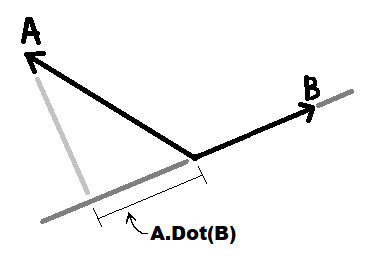

# Vector 3D

## Length

```csharp
public float Length( this Vector3 v )
  => Math.Sqrt( v.x*v.x + v.y*v.y + v.z*v.z );
```

The sqrt operation is a lot to compute, so sometimes a `LengthSquared` is better:

```csharp
public float LengthSquared( this Vector3 v )
  => v.x*v.x + v.y*v.y + v.z*v.z;
```


## Normalizing

Unit vectors (of length 1) are super handy. Any time there is a '1' in math, that allow it to be squashed and stretched with multiplication, while maintaining properties relative to the '1'.

Converting a vector into a Unit Vector is called Normalizing.

### Normalized function
```csharp
public Vector3 Normalized( this Vector3 v )
  => (v.x == 0 && v.y == 0 && v.z == 0) ? Vector3.Zero : v / v.Length();
```


## Dot Product

The dot product is commutative, meaning order does not matter.

The common, simplified explanation of what the dot product does is that it "projects" one vector onto another:


This projection does not have to hit the other vector, it just project onto that vector as an infinite line.

The dot product will return a negative value if projected onto the other side of the origin like so:



### Dot product function
```csharp
public float Dot( this Vector3 a, Vector3 b )
  => a.x*b.x + a.y*b.y + a.z*b.z;
```


## Projection

The dot product returns a number (aka a scalar value,) _not_ a vector.
To perform a projection and get back a vector, you can do so _using_ the dot product and the normal of the target vector. This operation is not commutative.

### Project function
```csharp
public Vector3 Project( this Vector3 a, Vector3 b )
  => a.Dot( b ) * b.Normalized();
```
